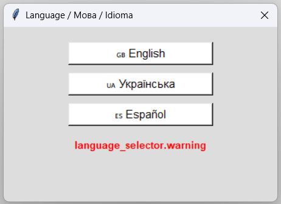
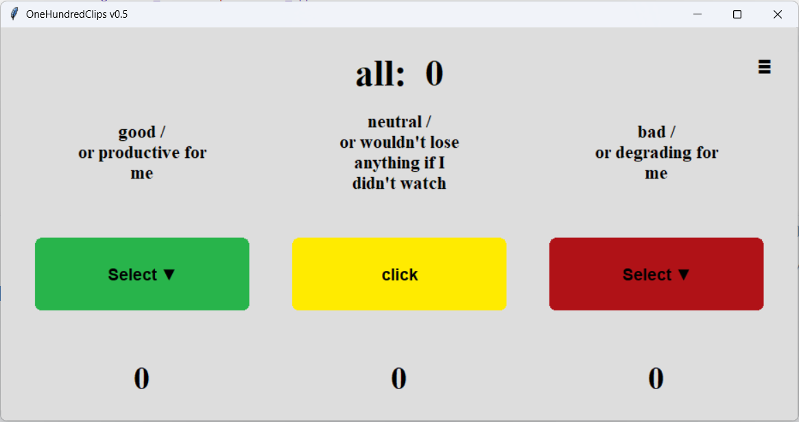
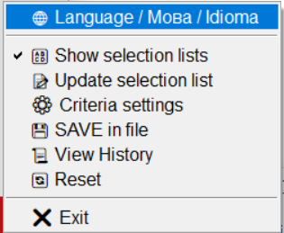
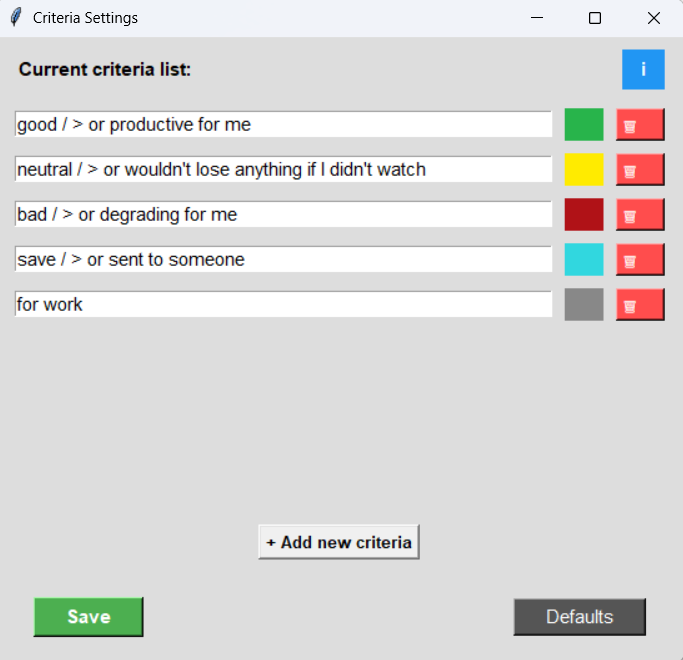
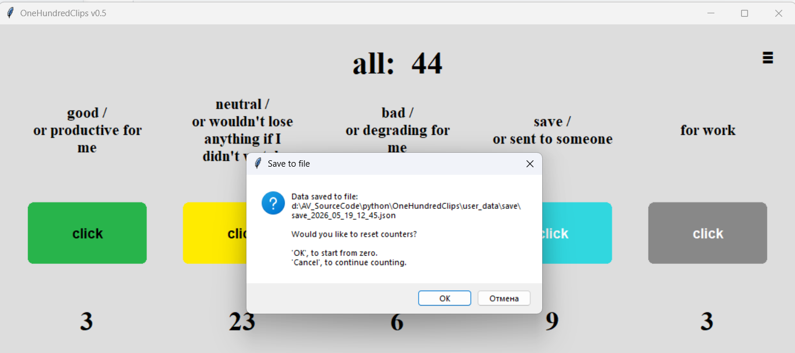
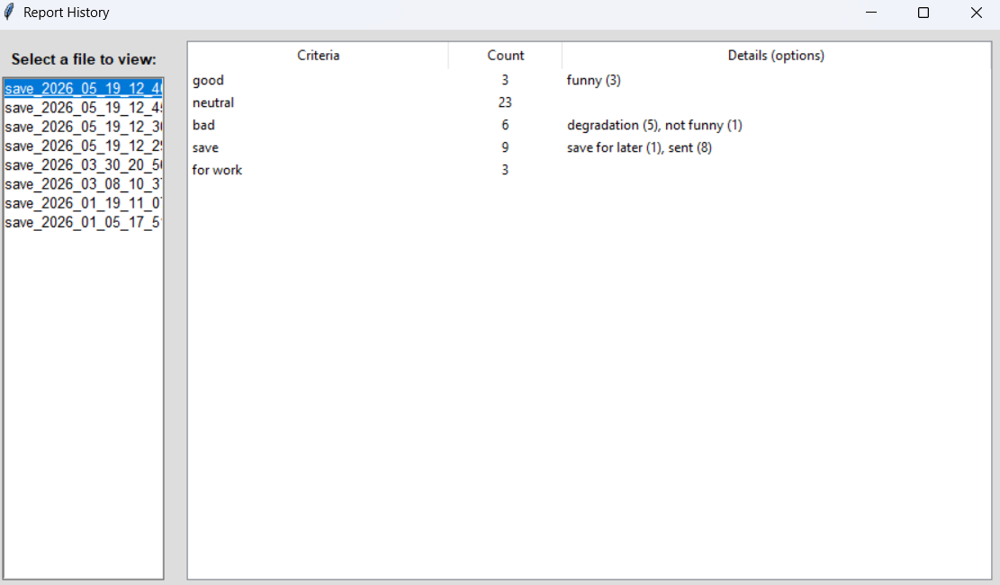

# 🀄️ OneHundredClips: Analysis 100 TikTok 

<div align="center">
  <a href="README.md">🇬🇧 English </a> | 
  <a href="README.ua.md">🇺🇦 Українська</a> | 
  <a href="README.es.md">🇪🇸 Español</a>
</div>

---

### 🖥️ Platform:
**PC - Windows**

--- 

### 📘 Description:
This is a simple program for counting and analyzing viewed videos (for example, on TikTok, Reels, Shorts). 
The overall goal is to watch 100 or more videos and categorize them:
  - 🟢 Good / Useful
  - 🟡 Neutral
  - 🔴 Bad / Degraded

This app helps make content consumption analysis simpler and more visual.

---

### 📸 Screenshots:
* **Language Selector at Launch:**
  <br>
* **Main Window:**
  <br>
* **Menu:**
  <br>
* **Criteria Editor:**
  <br>
* **Save to File:**
  <br>
* **History Viewer:**
  <br>

--- 

### 🛠️ Tech Stack: 
- **Python 3.12**
- **Tkinter ( Graphical User Interface / GUI )**
- **JSON ( Data Persistence & Configuration )**

--- 

### 🚀 How to run:

Make sure you have Python 3.12+ installed.

```bash
  cd OneHundredClips
  python main.py
```

--- 

### 🏗️ Project Architecture:

Following the separation of concerns principle, the project structure is strictly divided into source code, user data, and localization files:

```bash
OneHundredClips/

├── locales/                  # 🌐 i18n language files
├── user_data/                # 📂 User generated data
│   ├── save/                 # History of daily reports
│   ├── settings.json         # User settings & custom criteria
│   └── data.json             # Current counting session
├── src/                      # 💻 Source code
│   ├── config.py             # Global configurations & i18n
│   ├── storage.py            # Data persistence logic
│   ├── app_logic.py          # Core application math and logic
│   └── gui/                  # 🎨 Graphical User Interface
│       ├── main_window.py    # Main UI setup and grid
│       ├── windows/          # Separate popup windows
│       └── components/       # Reusable UI building blocks 
├── assets/                   # 📸 Screenshots for README
├── README.md                 # Project documentation
└── main.py                   # 🚀 Application entry point
```

--- 

### 📈 Future Improvements:

1. [+] Adding the ability to select from a list when pressing a button, and the option to disable this feature.
2. [+] More detailed report with results of button presses and selected options.
3. [+] Creating a custom selection from the list for the button within the app + saving to a JSON file.
4. [+] Editing the criteria text (adding custom criteria) within the app + saving to a JSON file.
5. [+] Load and view previous save files directly in the app.
6. [+] Add multiple UI languages (i18n).
7. [?] Other...

--- 
*(MY APP #2)*